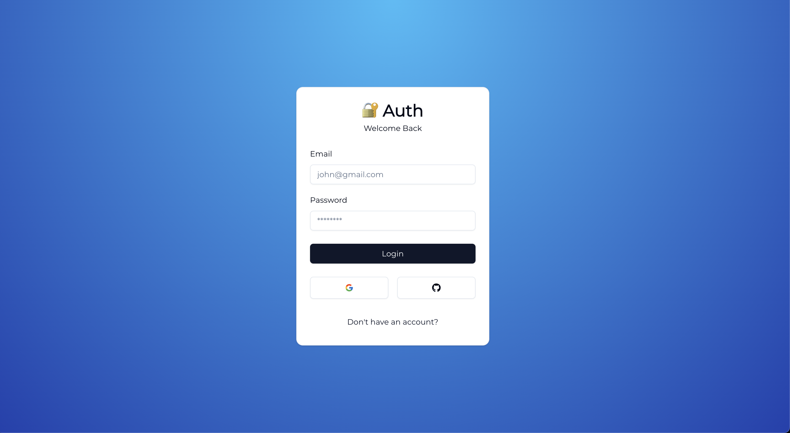
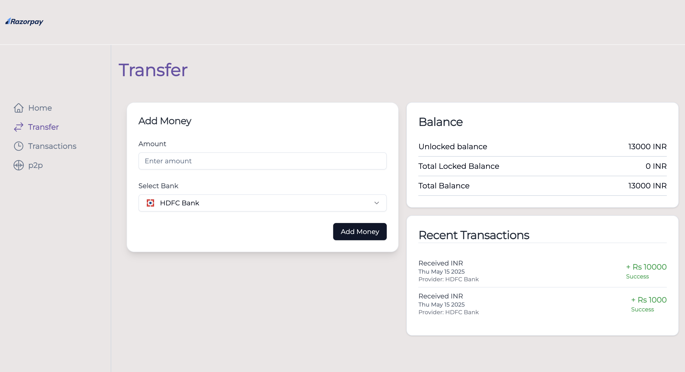
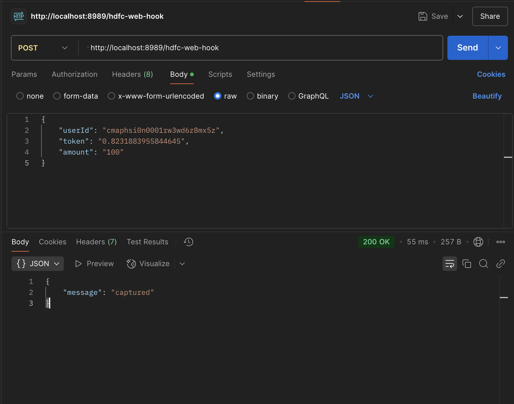
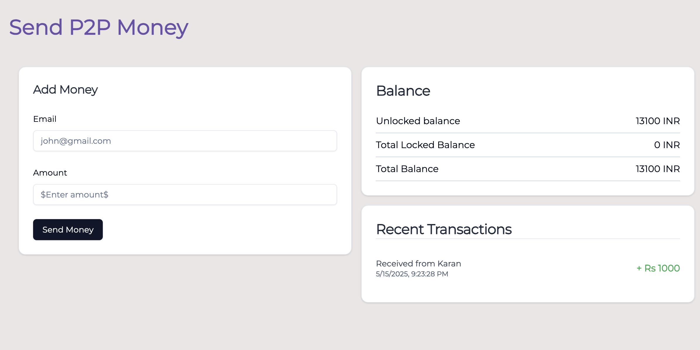
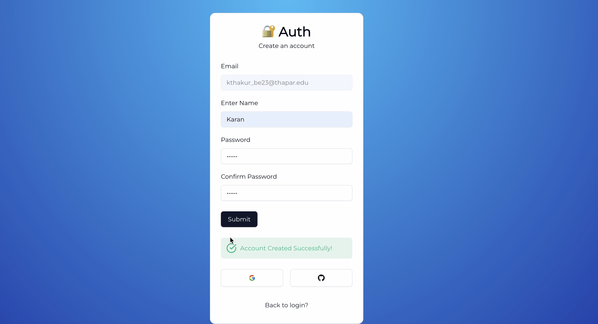
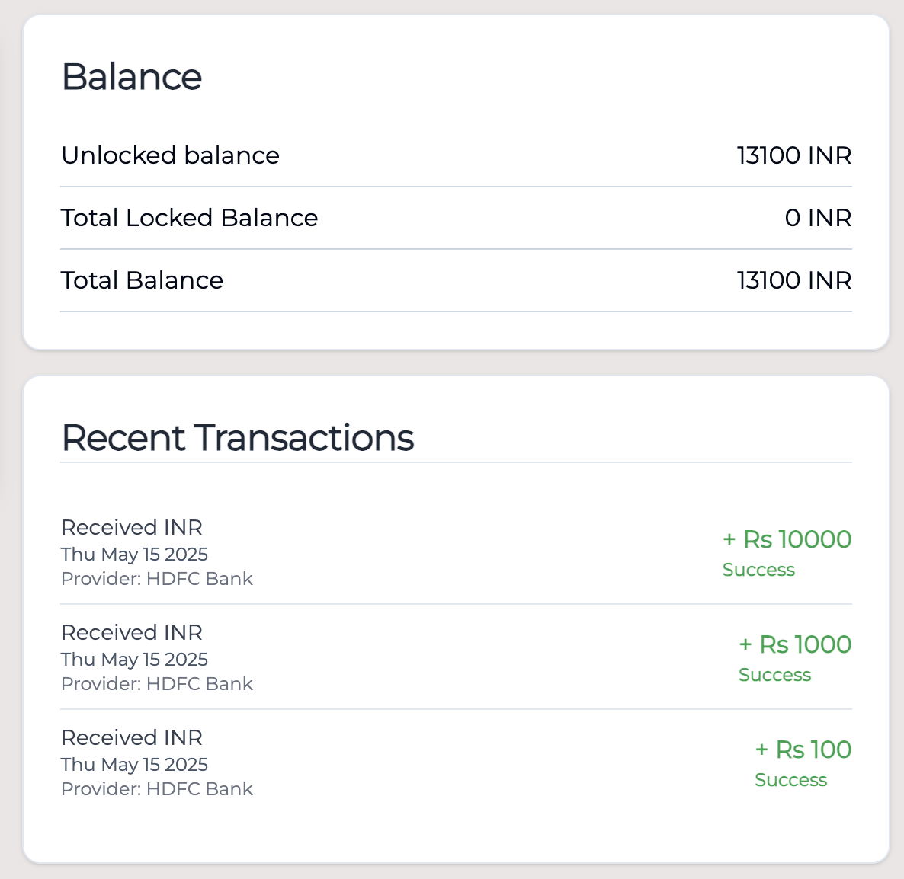
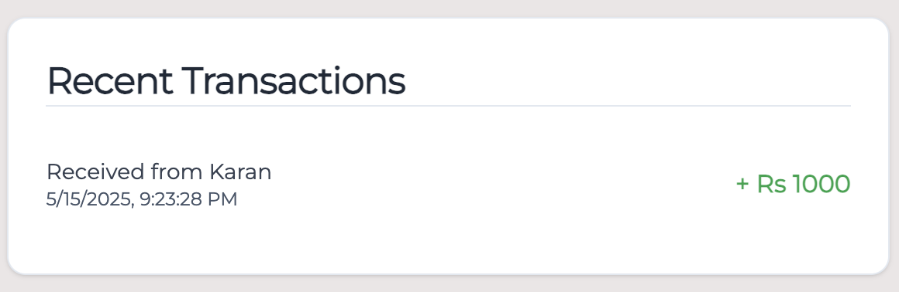

# 📱 Banking System (PayTM Clone)

## 📌 Abstract

This project implements a secure and efficient Peer-to-Peer (P2P) payment system inspired by PayTM. The platform enables users to sign up, deposit money via on-ramp transactions, and transfer funds to other users in real-time using Prisma's raw SQL support. It handles transactional safety, locking, and balance management using PostgreSQL. The goal is to simulate a basic real-world wallet system with core functionalities including balance locking, tracking, and fund transfers.

---

## 🧭 Introduction

Digital wallets are now integral to daily transactions. This project showcases a simplified but realistic implementation of such a wallet system:

### 🎯 Goals:

* Enable users to register and store money
* Allow on-ramp (deposit) functionality
* Support secure P2P fund transfers
* Lock amounts during processing

### 🛠️ Technologies Used:

* **Next.js / React** frontend
* **Express** for webhook
* **Prisma ORM (with raw SQL)**
* **PostgreSQL** for persistent storage
* **UUID** for primary key generation
* **bcryptjs** for password security

### 📊 Architecture:

```
[Frontend] → [Next.js Actions] → [Prisma Raw SQL] → [PostgreSQL DB]
```

---

## 🛠️ Implementation Details

### ✅ Signup Flow

* Validates user input
* Hashes password
* Inserts user using `INSERT INTO` via `$queryRaw`
* Initializes user balance and account rows

```ts
await tx.$queryRaw`
  INSERT INTO "User" (id, name, email, password)
  VALUES (${id}, ${name}, ${email}, ${hashedPassword})
  RETURNING *;
`;
```

📷 Screenshot:


---

### 💳 On-Ramp (Deposit Money)

* Generates token and locks amount
* Creates `OnRampTransaction`
* Increments `locked` in `Balance`

```ts
await db.$executeRaw`
  INSERT INTO "OnRampTransaction" (id, "userId", amount, status, "startTime", provider, token)
  VALUES (${id}, ${userId}, ${scaledAmount}, 'Processing', ${new Date()}, ${provider}, ${token})
`;
```

📷 Screenshot:


---

### 🔁 Webhook: Capturing Payment

* Updates balance
* Updates transaction status
* Unlocks locked amount

```ts
await db.$transaction(async (tx) => {
  await tx.$queryRaw`
    UPDATE "Balance"
    SET amount = amount + ${amount * 100}
    WHERE "userId" = ${userId}
  `;

  await tx.$queryRaw`
    UPDATE "OnRampTransaction"
    SET status = 'Success'
    WHERE token = ${token}
  `;

  await tx.$executeRaw`
    UPDATE "Balance"
    SET locked = locked - ${amount * 100}
    WHERE "userId" = ${userId}
  `;
});
```

📷 Screenshot:


---

### 🤝 P2P Transactions

* Locks sender's row with `FOR UPDATE`
* Checks available balance
* Updates both sender and receiver balances
* Inserts into `P2PTransfer`

```ts
await tx.$executeRaw`
  INSERT INTO "P2PTransfer" (id, "senderId", "receiverId", amount, status, "startTime")
  VALUES (${uuidv4()}, ${fromId}, ${receiverId}, ${amount * 100}, 'Success', ${new Date()})
`;
```

📷 Screenshot:


---

## ✅ Results

* User can sign up and receive starting balance.
* Deposits go through webhooks and reflect in balance.
* P2P transfers safely handle concurrent access.

📷 Screenshots:

* 
* 
* 

---

## 🧾 Conclusion

This project simulates a working financial transaction system with precision, concurrency control, and transactional integrity. By using raw SQL with Prisma, we get fine control over database behavior while retaining type safety. Key learnings include:

* Managing transactions via `$transaction`
* Manual locking and safety using `FOR UPDATE`
* Ensuring schema discipline (UUIDs, timestamps)

### 🚀 Future Improvements:

* Add Home frontend
* Add transaction history UI
* 
* Integrate payment gateways (e.g., Razorpay)

---